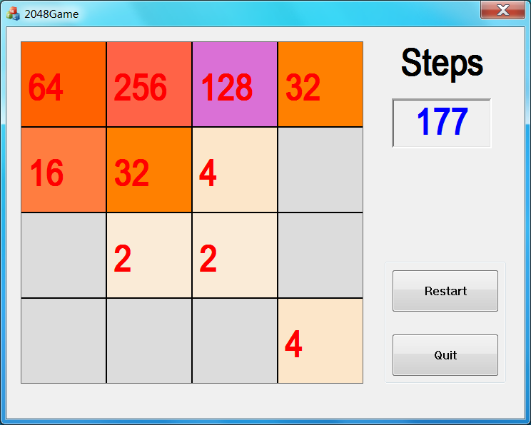

## Famous Game 2048
A C++/MFC version (Based on `Visual Studio 2013`) of the popular 2048 Game

Game logic is written in C++, the GUI in MFC.

The core algorithm is in GameLogic.cpp/GameLogic.h files

## Screenshot

## Build Instructions
1. Make sure you have install `Visual Studio 2013`
2. Clone the code, double click `2048Game.sln` to open the solution
3. Build the solution with `build all`
4. Run the code with `Run (Ctrl + F5)`